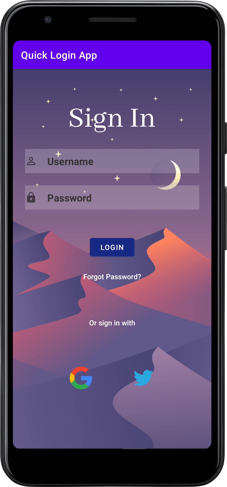

# Quick Login App

This Android project is a simple login application that allows users to enter a username and password.
The app also provides quick access to Google and Twitter through dedicated buttons.

## Features

- **Login Functionality**: Users can enter a username and password, and the app validates the login credentials.
- **Google Access**: The app includes a button to quickly open Google in a web browser.
- **Twitter Access**: Another button is provided for quick access to the Twitter website.

## Getting Started

1. Clone the repository:

   ```bash
   git clone https://github.com/Hardvan/QuickLogin-App.git
   ```

2. Open the project in Android Studio.

3. Build and run the app on an emulator or physical device.

## Usage

1. Launch the app on your Android device.

2. Enter a username and password.

3. Click the "Login" button to validate the credentials.

4. Use the Google and Twitter buttons to quickly access the respective websites.

## Screenshots


